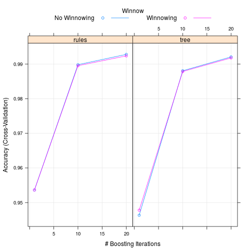

## Introduction

Devices such as Jawbone Up, Nike FuelBand, and Fitbit have made easy to collect a plenty of personal activity data at low cost. These kind of devices are used to quantify self movement by zealots who measure their activities regulary to be fit, to recognize their behavioral patterns, or for they are no more than technology eccentrics. They regularly quantify how much of a particular activity they do, but they seldom pay attention to how well they do it.

In this project, we analyse data from accelerometers on the belt, forearm, arm, and dumbell of 6 examinees. They were asked to perform 10 repeting unilateral dumbbel biceps curl in 5 different ways:exactly according to the specification (Class A), throwing the elbows to the front (Class B), lifting the dumbbell only halfway (Class C), lowering the dumbbell only halfway (Class D) and throwing the hips to the front (Class E)Read more: http://groupware.les.inf.puc-rio.br/har#ixzz3mneH6Stk.

Our goal is to apply machine learning algorithm to predict the status of exercise.


## Loading libraries


```r
library(plyr)
library(dplyr)
```

```
## 
## Attaching package: 'dplyr'
## 
## The following objects are masked from 'package:plyr':
## 
##     arrange, count, desc, failwith, id, mutate, rename, summarise,
##     summarize
## 
## The following object is masked from 'package:stats':
## 
##     filter
## 
## The following objects are masked from 'package:base':
## 
##     intersect, setdiff, setequal, union
```

```r
library(caret)
```

```
## Loading required package: lattice
## Loading required package: ggplot2
```

```r
library(C50)
```

### Downloading the data

```r
trainingUrl <- "https://d396qusza40orc.cloudfront.net/predmachlearn/pml-training.csv"
testUrl <- "https://d396qusza40orc.cloudfront.net/predmachlearn/pml-testing.csv"
trainingFile <- "~/Rwork/PML/data/training.csv"
testFile <- "~/Rwork/PML/data/testing.csv"

if(!file.exists("~/Rwork/PML/data")){
  dir.create("~/Rwork/PML/data")
  }

if(!file.exists(trainingFile)){
  download.file(trainingUrl, destfile=trainingFile)
}

if(!file.exists(testFile)) {
  download.file(testUrl, destfile=testFile)
}
```

## Reading the data
After downloading being completed, we read the data as two csv files with setting blanks and "#DIV/0!" as NA.


```r
trainData <- read.csv("~/Rwork/PML/data/training.csv", header = T, na.strings = c("NA", "", "#DIV/0!"))
testData <- read.csv("~/Rwork/PML/data/testing.csv", header = T, na.strings = c("NA", "", "#DIV/0!"))
list(dim(trainData), dim(testData))
```

```
## [[1]]
## [1] 19622   160
## 
## [[2]]
## [1]  20 160
```

## Cleaning the data

There being some NAs in the data, we select columns which don't contain NAs which I think are suitable for analysis.


```r
noNAtrain <- trainData %>% select(which(colSums(is.na(trainData)) == 0)) 
##trainData <- trainData[, colSums(!is.na(trainData)) == nrow(trainData) ]
noNAtest <- testData %>% select(which(colSums(is.na(testData)) ==  0))
```

The data also containing descriptive data which are not sensor values, we may well get rid of them.

```r
train <- noNAtrain %>% select(-(1:7))
test <- noNAtest %>% select(-(1:7))
dim(train)
```

```
## [1] 19622    53
```

```r
dim(test)
```

```
## [1] 20 53
```

## Slicing the data

Cleaned train data are splitted in two parts 70% training and 30% test.

```r
set.seed(671) ## set.seed for reproducibility
inTrain <- createDataPartition(train$classe, p = 0.7, list = FALSE)
training <- train[inTrain,]
testing <- train[-inTrain,]
```

## Creating a data model with C5.0 algorithm

First, svm algorithm was used to create a model. However, its performance was not satisfied(data not shown). Therefore, C5.0 algorithm is applied to generate the model and we are going to use 5-fold cross validation.


```r
tc <- trainControl(method = "cv", number = 5)## 5 times cv
modelC5 <- train(classe ~., data = training, method = "C5.0",trControl = tc)## using c5.0 algorithm
plot(modelC5)
```

 

```r
modelC5$finalModel
```

```
## 
## Call:
## C5.0.default(x = structure(c(1.41, 1.41, 1.42, 1.48, 1.45, 1.42,
##  143, 144, 144, 145, 144, 143, 0, 0, 0, 0, 0, 0, 0, 0, 0, 0, 0, 0, 0,
##  0, 0, 0, 0, 0, 0, 0, 0, 0, 0, 0, 0, 0, 0, 0, 0, 0, 0, 0, 0, 0,
## 
## Rule-Based Model
## Number of samples: 13737 
## Number of predictors: 52 
## 
## Number of boosting iterations: 20 
## Average number of rules: 159.4 
## 
## Non-standard options: attempt to group attributes
```

```r
## summary(modelC5$finalModel)

predictC5 <- predict(modelC5, testing)## validation
confusionMatrix(testing$classe, predictC5)
```

```
## Confusion Matrix and Statistics
## 
##           Reference
## Prediction    A    B    C    D    E
##          A 1670    4    0    0    0
##          B    6 1131    2    0    0
##          C    0    7 1013    5    1
##          D    0    0    6  958    0
##          E    0    2    0    1 1079
## 
## Overall Statistics
##                                          
##                Accuracy : 0.9942         
##                  95% CI : (0.9919, 0.996)
##     No Information Rate : 0.2848         
##     P-Value [Acc > NIR] : < 2.2e-16      
##                                          
##                   Kappa : 0.9927         
##  Mcnemar's Test P-Value : NA             
## 
## Statistics by Class:
## 
##                      Class: A Class: B Class: C Class: D Class: E
## Sensitivity            0.9964   0.9886   0.9922   0.9938   0.9991
## Specificity            0.9990   0.9983   0.9973   0.9988   0.9994
## Pos Pred Value         0.9976   0.9930   0.9873   0.9938   0.9972
## Neg Pred Value         0.9986   0.9973   0.9984   0.9988   0.9998
## Prevalence             0.2848   0.1944   0.1735   0.1638   0.1835
## Detection Rate         0.2838   0.1922   0.1721   0.1628   0.1833
## Detection Prevalence   0.2845   0.1935   0.1743   0.1638   0.1839
## Balanced Accuracy      0.9977   0.9935   0.9947   0.9963   0.9992
```
Accuracy of this model is 99.4%. Among each class, sensitivity and specificity are around 99% or more. 

## Predicting test data set.

We predict test data using the model.


```r
test <- test %>% select(which(colnames(test) %in% colnames(training)))

predictTestData <- predict(modelC5, test)
predictTestData
```

```
##  [1] B A B A A E D B A A B C B A E E A B B B
## Levels: A B C D E
```

## Submission 


```r
pml_write_files = function(x){
  n = length(x)
  for(i in 1:n){
    filename = paste0("problem_id_",i,".txt")
    write.table(x[i],file=filename,quote=FALSE,row.names=FALSE,col.names=FALSE)
  }
}

pml_write_files(predictTestData)
```


